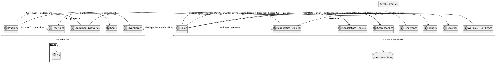

# stackoverflow-minigame
You’re a stack frame trying to climb higher without overflowing.
## Build and run
Requirements: .NET SDK (9.0 or later) installed. Verify with `dotnet --version`.
From the repository root:
1. Build:
   ```bash
   dotnet build
   ```
2. Run:
   ```bash
   dotnet run
   ```
   
The project uses a single SDK-style project file `stackoverflow-minigame.csproj` in the repository root, and a solution file `stackoverflow-minigame.sln` is already included.
## Gameplay
**Boot-up**  
- Launch from a real terminal. If input/output is redirected, the game warns you and exits safely.  
- Tap any key on the splash screen to start climbing. `Q`/`Esc` quits immediately, `R` restarts after a fall.  
- Before the first jump you’ll enter three-character arcade initials; the blinking 5×5 glyph prompt only accepts A–Z/0–9 and falls back to your last initials if the console can’t read keys.

**Controls & Movement**  
- `A`/`D` or `←`/`→`: drift horizontally. Intent lingers for ~0.12 s, so quick taps still translate into motion.  
- `S`/`↓`: trigger a fast-drop burst to dive through gaps.  
- `H`: cycle HUD visibility (Full → Compact → Hidden) to reclaim vertical space on cramped buffers.  
- `Q`/`Esc`: bail out from anywhere outside blocking prompts.

**World & Objective**  
- The world is a 60×38 shaft wrapped in a cyan frame—touching the border clears your horizontal intent but keeps you on-screen.  
- Platforms spawn in bands: wide/dense near the base, narrow and spaced near the top. Landing on a higher, untouched platform awards a level and auto-launches your next jump.  
- Drop below the camera offset or miss a platform and the run ends. Survive 256 platform awards to “clear the error stack” and win.

**HUD & Feedback**  
- Stats sit under the playfield and show initials, level, landing score, current/max altitude, best run, and a `mm:ss.fff` stopwatch.  
- A progress bar tracks your march to 256 levels and shifts red → yellow → green. The HUD text turns red when you’re within three rows of the fail line.  
- Run with `dotnet run -- trace` to see verbose diagnostics for glyph lookups and initials entry.

**Persistence & Leaderboards**  
- Finished runs append to `scoreboard.jsonl` (newline-delimited JSON shared in the repo).  
- Run `dotnet run -- leaderboard` (or `./launch-leaderboard.sh`) in another terminal to view live top-level and fastest-run boards; press `Q`/`Esc` to close the viewer. You can also tap `L` on the game’s main menu to open the built-in leaderboard overlay and return with `Q`/`Esc`.
## Runtime Flow


> Note: Only the rendered image is provided; the PlantUML source code for this diagram is not included in the repository.
